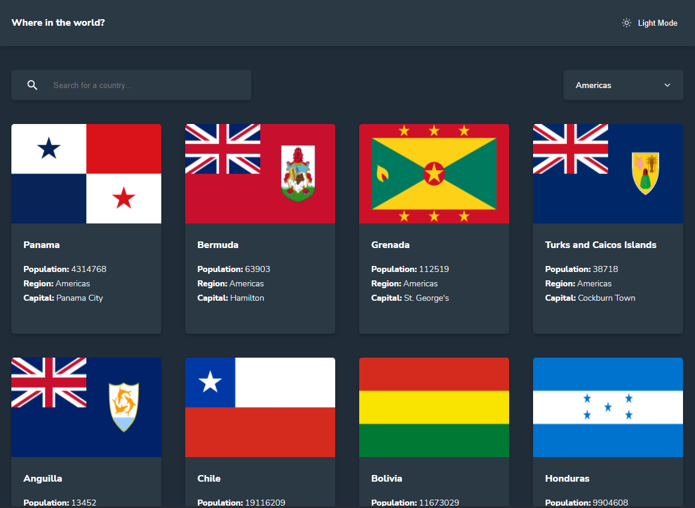

<h1 align="center">
 
  
 
 
</h1>

O rest-countries-api é uma interface para a api do https://restcountries.com, trazendo assim informações básicas sobre os países. Esse projeto é um desafio feito pela plataforma https://frontendmentor.io

  

[//]: # (Add your gifs/images here:)

  

## Features
[//]: # (Add the features of your project here:)

- ⚛️ **React Js** — Uma biblioteca Javascript para construção de interface de usuário.
- ⚛️ **Next JS** - É um framework React que oferece a melhor experiência de desenvolvimento com todos os recursos de que você precisa para produção: renderização híbrida estática e de servidor, suporte a TypeScript, agrupamento inteligente e muito mais.
- 💅 **Styled Components** - É uma biblioteca para React e React Native que permite que você use estilos ao nível de componente na sua aplicação. Eles são escritos em uma mistura de JavaScript com CSS.
- 🌐 **Axios** - É um cliente HTTP baseado em Promises para fazer requisições. Pode ser utilizado tanto no navegador quanto no Node. js.

## Iniciando

1. Clone este repositório usando `git clone git@github.com:Salv-Dev/rest-countries-api.git`
2. Vá para o diretório: `cd rest-countries-api` 
### Iniciando o frontend

1. Rode `npm i` para instalar as dependências.
2. e Rode `npm run dev` para iniciar a aplicação em modo desenvolvedor.

## License

This project is licensed under the MIT License - see the [LICENSE](https://opensource.org/licenses/MIT) page for details.
